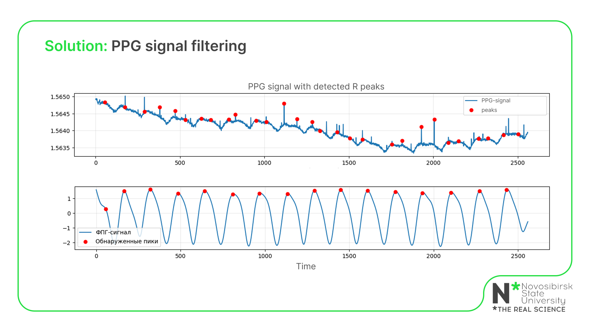

# PPG Signal Processing Toolkit


The SLBPPG framework provides tools for processing the PPG signal.

## Installation

```bash
pip install SLBPPG==0.1
```

## Methods

- **SLBPPG.filter(ppg, ppg_fr)** \
**Input**: \
&nbsp;&nbsp;&nbsp;&nbsp;PPG signal and sampling rate \
**Returns**:
    - PPG signal to which the frequency filter is applied, followed by floating window normalization. The filter also recognizes noise and replaces it with zeros.
    - Frequency filter and normalization only, no noise reduction
- **StressIndex.predict(ppg)** \
**Input**: \
&nbsp;&nbsp;&nbsp;&nbsp;PPG signal and sampling rate \
**Returns**: \
&nbsp;&nbsp;&nbsp;&nbsp;Itress index (on a five-point scale) for each window, duration 1 minute, by default

>You can view the usage example and learn more about the methods in the [file](https://github.com/IlyaKarakulin/Stress-level-by-PPG/blob/main/demo/example.ipynb)


## For what?

### **Problem** \
A special feature of the FPG sensor is that it is highly sensitive to motion, so that a lot of the captured data is not suitable for further analysis. This type of signal is used in human condition monitoring systems using wearable devices such as smart watches or medical bracelets.


For comparison, this is what a quality FPG signal should look like:


- **The peaks are periodic** \
- **There is no noise** \

### **Solution** \

To determine the stress level, we need to calculate the period of each heartbeat. Existing frameworks read peaks incorrectly: they detect emissions and both phases of the heartbeat, when we need only one. The filter we have developed processes the signal in such a way as to highlight the main contraction frequency and detect the peaks already on it.



Those signal segments where it is impossible to detect the reduction period due to high noise, our filter cuts out with IoU 0.87. Thus we guarantee that stress will be counted only on valid data:


